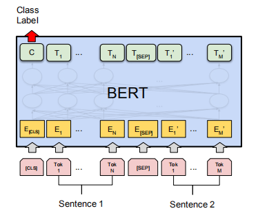

# TCGAIIC

## 简介

阿里天池AI技术创新赛赛道三小布助手，赛题要求根据脱敏后的短文本query-pair，预测0~1之间的浮点数，代表语义匹配的概率。

## 成绩

评估采用$AUC$指标，$T$和$F$表示语义匹配和不匹配的样本集合，$M$和$N$表示它们的样本个数，$AUC=\frac{\sum_{x\in T} rank(x)}{MN}-\frac{1+M}{2N}$。

最终初赛成绩46/5345，复赛成绩44/100。

## 算法

采用BERT模型处理句子对任务，做二分类。

由于赛题脱敏，需要自行预训练，将比赛脱敏词和公开语料词作词频对齐，用[Transformers](https://huggingface.co/models)库中权重初始化，MLM和2-gram MLM混合预训练。

微调阶段初赛引进FGM对抗训练，但是复赛影响很小，仍然采用原始句子对分类模型。

推理阶段使用多个模型预测结果平均值，可以较大提升成绩。

## 部署

部署采用Docker+Flask+ONNX，Docker镜像环境需要PyTorch1.6，cuda10.1和cuDNN7，最终顺序预测50000条数据，六个模型融合，每条数据平均耗时0.0155秒。

